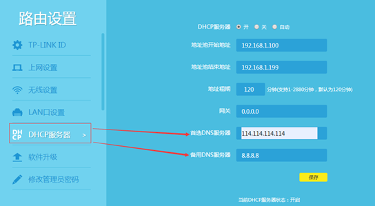

修改路由器的DNS

修改路由器的dns则是把连接路由器的所有终端进行修改，该修改项是存在于dhcp信息里，因此每个连接该路由器的终端都会获取到设置的dns。但需要注意一点，若终端已连接路由器，路由器在更改dns之后无重启操作，那么之前连接的终端依然以之前获取的dns来解析，除非路由器进行重启，或者让终端进行重新连接。

修改路由DNS的方法：打开网址192.168.1.1/以管理员密码登录到路由器管理页面，做下图设置：

useful links

https://www.cnblogs.com/leiblog/p/10716959.html

