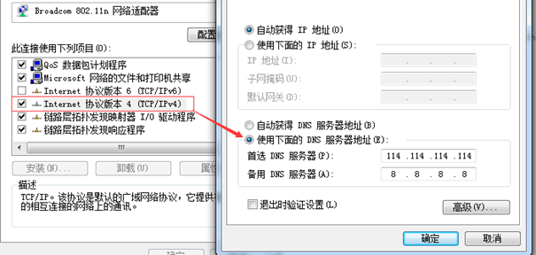

# How to Change DNS Settings on Your OS(Debian 12)

| Item    | Describe | Dir   | content |
| -------- | ------- | -------- | ------- |
| domain <--> ip | $250    | January  | $250    |
| host name | $80     | February | $80     |
| dns nameserver   | $420    | cat /etc/resolv.conf   | # Generated by NetworkManager
nameserver 192.168.1.1
nameserver 192.168.2.1

nameserver 114.114.114.114    |

## linux

~~~

PRETTY_NAME="Debian GNU/Linux 12 (bookworm)"
NAME="Debian GNU/Linux"
VERSION_ID="12"
VERSION="12 (bookworm)"
VERSION_CODENAME=bookworm
ID=debian
HOME_URL="https://www.debian.org/"
SUPPORT_URL="https://www.debian.org/support"
BUG_REPORT_URL="https://bugs.debian.org/"

~~~

Linux下有三个网络配置文件 /etc/hosts、/etc/host.conf、/etc/resolv.conf 

~~~
/etc/resolv.conf   dns nameserver
/etc/hostname      host name
/etc/hosts         domain <--> ip
~~~

nameserver 114.114.114.114

cat /etc/resolv.conf

~~~
# Generated by NetworkManager
nameserver 192.168.1.1
nameserver 192.168.2.1

nameserver 114.114.114.114 
~~~

cat /etc/hostname

~~
raspberrypi
~~

cat /etc/hosts
~~~
127.0.0.1	localhost
::1		localhost ip6-localhost ip6-loopback
ff02::1		ip6-allnodes
ff02::2		ip6-allrouters

127.0.1.1		raspberrypi
185.199.108.133 raw.githubusercontent.com
140.82.114.4 github.com
~~~

~~~
hosts文件是linux系统中负责ip地址与域名快速解析的文件
以ASCII格式保存在/etc目录下
文件名为hosts(不同的linux版本，文件也可能不同，比如Debian的对应文件是/etc/hostname。)
hosts文件包含了ip地址和主机名之间的映射，包括主机名的别名(在没有域名服务器的情况下，系统上的所有网络程序都通过查询该文件来解析对应于某个主机名的ip地址，否则就需要使用DNS服务程序来解决。)
通常可以将常用的域名和ip地址映射加入到hosts文件中，实现快速方便的访问

~~~

优先级：dns缓存>hosts>dns服务

before
~~~
ping github.com
PING github.com (20.205.243.166) 56(84) bytes of data.
~~~

after

~~~
ping github.com
PING github.com (140.82.114.4) 56(84) bytes of data.
64 bytes from github.com (140.82.114.4): icmp_seq=1 ttl=44 time=232 ms
64 bytes from github.com (140.82.114.4): icmp_seq=2 ttl=44 time=231 ms
~~~

raspberrypi's /etc/hosts

~~~
127.0.0.1	localhost
::1		localhost ip6-localhost ip6-loopback
ff02::1		ip6-allnodes
ff02::2		ip6-allrouters

127.0.1.1		raspberrypi
185.199.108.133 raw.githubusercontent.com
140.82.114.4 github.com
~~~

~~~
 ping github.com
PING github.com (140.82.114.4) 56(84) bytes of data.
64 bytes from github.com (140.82.114.4): icmp_seq=1 ttl=44 time=231 ms
64 bytes from github.com (140.82.114.4): icmp_seq=2 ttl=44 time=233 ms

~~~

~~~
一般文件位于： /etc/network/interfaces 或 /etc/sysconfig/network-scripts/ifcfg-<interface>（interface是你的网络接口，如eth0）。

sudo nano /etc/network/interfaces

添加DNS服务器： 在配置文件中，找到关于 DNS 的行，通常是类似于下面的形式：

dns-nameservers <DNS_IP_1> <DNS_IP_2>

将 <DNS_IP_1> 和 <DNS_IP_2> 替换为你想要使用的 DNS 服务器的实际 IP 地址。例如，使用 Google 的 DNS 服务器：

dns-nameservers 8.8.8.8 8.8.4.4

然后我们再保存并退出。

sudo service networking restart # Ubuntu/Debian
或
sudo systemctl restart network # CentOS

重启后生效。
~~~

### 刷新DNS缓存

debian12 刷新dns

~~~
sudo service networking restart
~~~

## windows 10

To change DNS Server in windows 10, follow these steps:
~~~
Tap Settings
Choose Network & Internet
Tap Advanced
Tap Private DNS
Tap Private DNS provider hostname
Fill in the desired hostname
Tap Save
~~~

修改windows缩主机的DNS server

修改本机的DNS
修改本机DNS只是影响本机的域名解析服务器，而不影响局域网中其它主机的DNS。

修改方法为：网络和共享中心选择"更改适配器设置"——>右键"无线网络连接"属性——>双击 "internet协议（TCP/IPV4）"。但是需要注意的一点是，更改完本机dns之后需要打开命令提示符，输入ipconfig /flushdns这条命令来刷新dns，否则更改完之后短时间之内还是以之前的dns来解析

修改方法为：网络和共享中心选择"更改适配器设置"——>右键"无线网络连接"属性——>双击 "internet协议（TCP/IPV4）"，做下图设置：

Windows 10

C:\Windows\System32\drivers\etc
~~~
185.199.108.133 raw.githubusercontent.com
140.82.114.4 github.com

ipconfig /flushdns
~~~

useful links

https://www.cnblogs.com/leiblog/p/10716959.html

github github520 project

github520项目每天会更新hosts内容，在项目页面，可以直接找到hosts内容，拷贝进系统的hosts文件即可。不同系统的hosts文件位置不同:
Windows下hosts文件位置为%systemroot%\Windows\System32\drivers\etc\hosts

Linux下则位于/etc/hosts

https://github.com/521xueweihan/GitHub520

