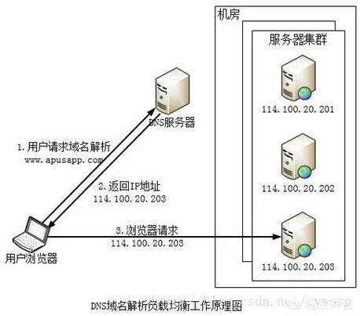

DNS就是将域名映射成ip的分布式数据库服务器，它的作用如下图：

常用的DNS服务器

1、114.114.114.114

　　114.114.114.114是国内移动、电信和联通通用的DNS，手机和电脑端都可以使用，干净无广告，解析成功率相对来说更高，国内用户使用的比较多，而且速度相对快、稳定，是国内用户上网常用的DNS。

2、8.8.8.8

　　8.8.8.8是GOOGLE公司提供的DNS，该地址是全球通用的，相对来说，更适合国外以及访问国外网站的用户使用。

~~~
router的DNS->缩主机的DNS /etc/resolv.conf -> 全部容器的 DNS 可以在/etc/docker/daemon.json -> 容器内的/etc/resolv.conf改动(不再关联缩主机的/etc/resolv.conf)
~~~

2.缩主机的DNS /etc/resolv.conf

3.配置全部容器的DNS /etc/docker/daemon.json

配置全部容器的 DNS 可以在/etc/docker/daemon.json文件中增加以下内容来设置

4.配置容器内的DNS /etc/resolv.conf

容器内的/etc/resolv.conf改动后，不再关联缩主机的/etc/resolv.conf

### Docker容器实例中解析DNS的顺序
~~~
查找Docker daemon内置的DNS服务器127.0.0.11

查找docker run创建容器实例时通过 --dns参数（容器定制）设置的DNS服务器

查找Docker daemon通过 --dns参数，或/etc/docker/daemon.json(容器通用设置)文件设置的DNS服务器

查找Docker宿主机上/etc/resolv.conf文件中配置的DNS服务器

最后，查找Google的DNS服务器，如8.8.8.8和8.8.4.4，2001:4860:4860::8888和2001:4860:4860::8844
~~~
由近及远原则，内置服务器优先级最高，其次容器定制的，再其次容器通用的，最后是缩主机的dns，最最后是路由器的

HassOS使用nmcli设置静态IPv4地址
https://blog.csdn.net/gongchenyu/article/details/134675480

DNS records for huggingface.co
https://www.nslookup.io/domains/huggingface.co/dns-records/#authoritative

~~~
ha network info                     
docker:
  address: 172.30.32.0/23
  dns: 172.30.32.3
  gateway: 172.30.32.1
  interface: hassio
host_internet: true
interfaces:
- connected: true
  enabled: true
  interface: enp2s4
  ipv4:
    address:
    - 192.168.2.119/24
    gateway: 192.168.2.1
    method: auto
    nameservers:
    - 192.168.1.1
    - 192.168.2.1
    ready: true
  ipv6:
    address:
    - fd18:f22c:7814:d900::1005/128
    - fd18:f22c:7814:d900:3461:9f3e:729e:9f94/64
    - fe80::f5d5:a437:c182:a251/64
    gateway: fe80::1af2:2cff:fe78:14d9
    method: auto
    nameservers:
    - fd18:f22c:7814:d900:1af2:2cff:fe78:14d9
    - '::'
    ready: true
  mac: 00:0C:
  primary: true
  type: ethernet
  vlan: null
  wifi: null
supervisor_internet: true

~~~
